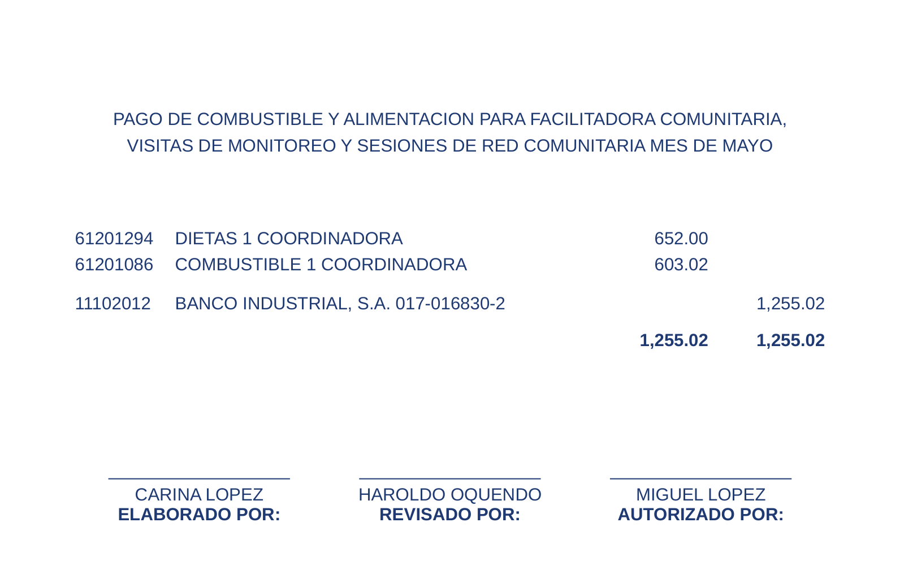
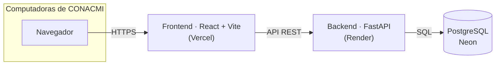
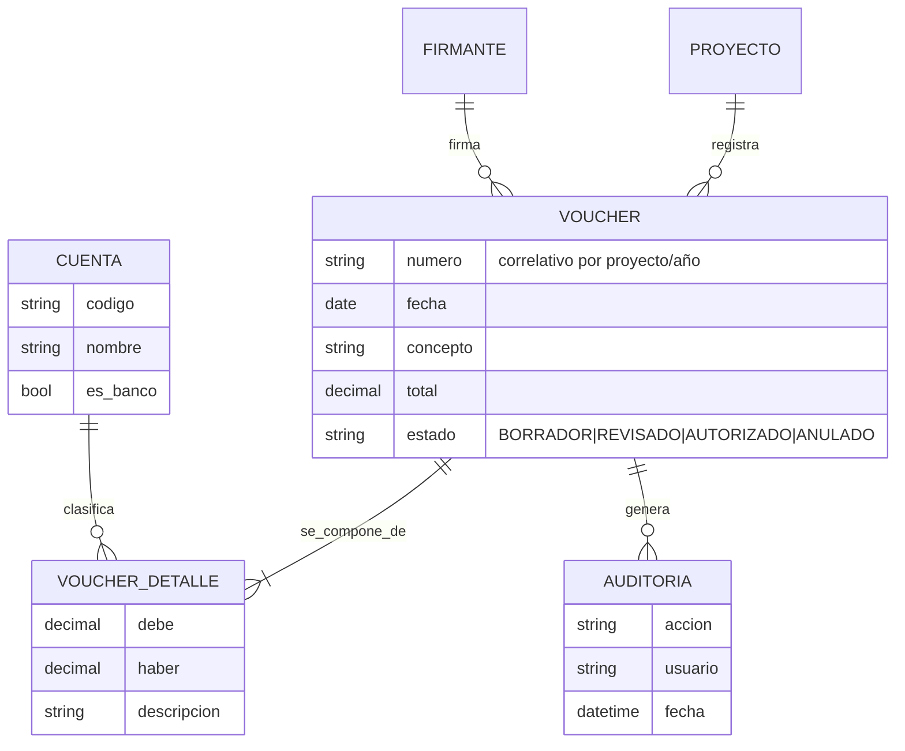

# 🧾 Sistema de Vouchers Contables — CONACMI

> Aplicación web full-stack que reemplaza un sistema de vouchers contables en Excel por una plataforma multiusuario, con cuadre garantizado, flujo de aprobación, impresión configurable y reportes. Construida para una ONG guatemalteca real.


---

## 🎯 El problema

CONACMI (Asociación Nacional Contra el Maltrato Infantil) llevaba sus **vouchers contables** (partidas de doble entrada) en un archivo de Excel. Eso traía problemas reales:

- Cualquiera podía guardar un voucher **descuadrado** (debe ≠ haber).
- La numeración era **manual** y se repetía o se saltaba.
- Trece mini-catálogos de cuentas **dispersos** y desactualizados.
- Sin **historial** de quién hizo o autorizó qué.
- Un solo archivo que **no se podía compartir** entre varias computadoras a la vez.

## ✅ La solución

Una aplicación web a la que las computadoras de la oficina entran por una **URL**, todas conectadas a **una sola base de datos compartida**. El sistema:

- **Garantiza el cuadre**: no deja finalizar un voucher si el debe no es igual al haber.
- **Numera solo** (correlativo por proyecto y año).
- Unifica el catálogo contable en **una sola fuente** (438 cuentas depuradas).
- Tiene un **flujo de estados** con bitácora: Borrador → Revisado → Autorizado → Anulado.
- **Imprime** el voucher con un formato configurable (pensado para ir debajo del comprobante del banco).
- Genera **reportes** (libro de vouchers y totales por partida) y exporta a **Excel**.

---

## 🖼️ El voucher impreso

El área de impresión es **configurable y se guarda**: tamaño de letra, espacios y posición. El voucher se ancla a la parte de abajo de la hoja, dejando la mitad superior libre para el comprobante del banco.



---

## ✨ Características

- **Cuadre en vivo** mientras se captura el voucher (montos con precisión decimal, nunca `float`).
- **Numeración automática** por proyecto/año (ej. `KNH-SALUD-2026-0001`).
- **Máquina de estados** con transiciones válidas y reglas de negocio.
- **Catálogo unificado** de 438 cuentas, con detección automática de la línea de banco.
- **Favoritos por uso**: las cuentas más usadas de cada proyecto se sugieren solas (el sistema aprende; no hay listas que mantener).
- **Impresión configurable** con vista previa en vivo, guardada en la base (igual en todas las máquinas).
- **Corrección ortográfica** en español con diccionario propio del dominio (no marca siglas como CONACMI, IGSS, ISR…).
- **Reportes**: libro de vouchers y totales por partida, con filtros y exportación a Excel.
- **Auditoría**: historial de acciones por voucher.

---

## 🏗️ Arquitectura



Las computadoras solo abren una URL; toda la lógica vive en el backend y los datos en una única base compartida.

## 🗃️ Modelo de datos



---

## 🛠️ Stack

| Capa | Tecnologías |
|------|-------------|
| **Backend** | Python 3.12, FastAPI, SQLAlchemy 2.0, Pydantic v2, pytest |
| **Frontend** | React 18, Vite, Tailwind CSS, React Router |
| **Base de datos** | PostgreSQL (Neon en producción · SQLite en local) |
| **Documentos** | Jinja2 (HTML/impresión), openpyxl (Excel), WeasyPrint (PDF, opcional) |
| **Despliegue** | Render (backend) · Vercel (frontend) · Neon (base) |

La misma variable `DATABASE_URL` permite correr el proyecto contra SQLite en local o PostgreSQL en la nube **sin cambiar una línea de código**.

---

## 🚀 Correr en local

**Backend**

```bash
cd backend
pip install -r requirements.txt
python scripts/seed.py        # carga catálogo, proyectos y firmantes
uvicorn app.main:app --reload # API en http://localhost:8000  (docs en /docs)
```

**Frontend** (en otra terminal)

```bash
cd frontend
npm install
npm run dev                   # http://localhost:5173
```

Sin configurar nada, el backend usa una base SQLite local. Para usar PostgreSQL, define `DATABASE_URL`.

---

## ☁️ Despliegue

Guía paso a paso en **[GUIA-DESPLIEGUE.md](GUIA-DESPLIEGUE.md)**: crear la base en Neon, desplegar el backend en Render (incluye `render.yaml` para hacerlo en un clic), publicar el frontend en Vercel y conectar todas las computadoras a la misma base.

---

## 📁 Estructura

```
.
├── backend/
│   ├── app/
│   │   ├── api/          # routers (cuentas, vouchers, documentos, reportes, configuración…)
│   │   ├── services/     # lógica de negocio (cuadre, numeración, estados, reportes…)
│   │   ├── models.py     # modelos SQLAlchemy
│   │   ├── schemas.py    # esquemas Pydantic
│   │   └── main.py
│   ├── templates/        # plantilla del voucher (impresión/PDF)
│   ├── scripts/seed.py   # carga inicial de datos
│   └── tests/            # pruebas (pytest)
├── frontend/
│   └── src/              # páginas, componentes y cliente de la API
├── docs/                 # análisis y diseño del sistema
├── render.yaml           # blueprint de despliegue del backend
└── GUIA-DESPLIEGUE.md
```

---

## 🧪 Pruebas

```bash
cd backend
pytest
```

20 pruebas que cubren el cuadre, la numeración, la máquina de estados, los documentos, los reportes, la ortografía y la auditoría.

---

## 🗺️ Estado y mejoras futuras

Sistema funcional y desplegado. Posibles siguientes pasos: inicio de sesión con roles (para registrar el usuario real en la auditoría), control de presupuesto por proyecto y panel de indicadores.

---

## 👤 Autor

**Marvin Muñoz** — desarrollador full-stack · Guatemala
Proyecto construido para un caso real de una ONG, como parte de un portafolio profesional.

## 📄 Licencia

MIT.
