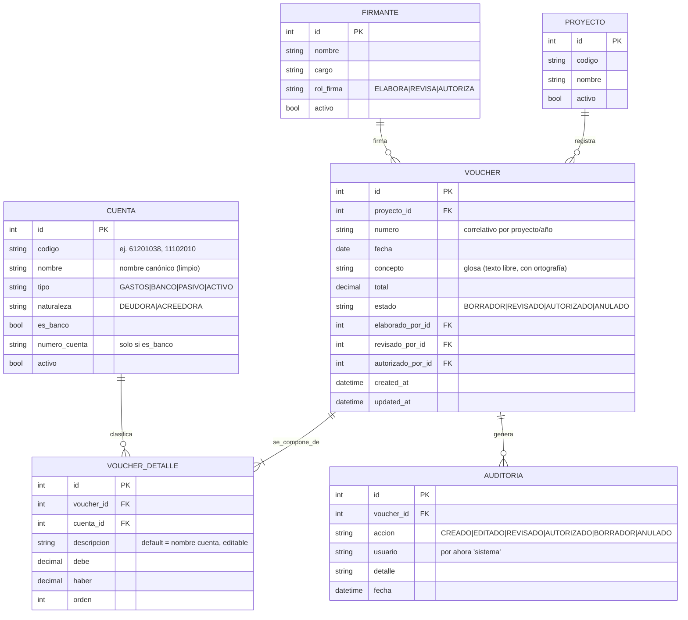

# Sistema de Partidas Presupuestarias y Vouchers Contables
### Documento de Análisis Funcional, Análisis Técnico y Diseño

> **Proyecto de portafolio** · Backend FastAPI · Frontend React · PostgreSQL
> Basado en el análisis del proceso real (archivo `Voucher_1A.xlsx`, 13 hojas, 122 partidas de gasto, 16 cuentas).

---

## 0. Resumen ejecutivo

Hoy el área contable de la organización genera sus **vouchers** (partidas contables de doble entrada) en un único libro de Excel con **una hoja por proyecto/fondo** (KNH Salud, KNH SF, ProVíctimas, Toy Box, BMZ, UNICEF, CONACMI…). Cada hoja contiene:

- Un **mini-catálogo lateral** de partidas frecuentes (columnas O–T, fuera del área de impresión).
- Uno o varios **vouchers apilados verticalmente**, cada uno con concepto, líneas de cargo (debe), línea(s) de abono (haber, normalmente el banco y a veces una retención de ISR), totales y tres firmas.
- Un **área de impresión fija** (`A1:M…`) en orientación vertical.

Este modelo funciona, pero es **frágil y manual**: el cuadre depende de fórmulas con rangos fijos, el catálogo está duplicado y con errores ortográficos en 13 hojas, no hay numeración formal, no hay historial ni búsqueda, y todo vive en un solo archivo con copias divergentes (`VOUCHER`, `VOUCHER.`, `CONACMI.`, `CONACMI. (2)`).

La propuesta **no es mejorar el Excel**: es construir una **aplicación web profesional** que centraliza el catálogo, garantiza el cuadre por diseño, automatiza la numeración y el formato, corrige ortografía, permite buscar e historiar, y exporta el voucher impreso a **PDF** y **Excel** con el mismo formato que se usa hoy.

---

## 1. Análisis del proceso actual

### 1.1 Anatomía de un voucher (estructura real observada)

Un voucher es un **asiento contable de doble entrada**. Su estructura, leída directamente del archivo, es:

| Zona | Ubicación en la hoja | Contenido |
|---|---|---|
| Encabezado en blanco | `A1:M28` (combinado) | Espacio para membrete/logo; empuja el contenido hacia abajo en la hoja impresa |
| Concepto / glosa | `A29:M29` (combinado) | Descripción del gasto (ej.: *"REINTEGRO DE PAGO DE ALIMENTACIÓN, COMBUSTIBLE PARA ASISTIR A REUNIONES…"*) |
| Líneas de **cargo** (debe) | filas ~33–38 | `A` = código de partida · `D` = nombre · `K` = monto al **debe** |
| Línea(s) de **abono** (haber) | fila ~39 | `A` = código de cuenta (banco / ISR) · `D` = banco + número de cuenta · `M` = monto al **haber** |
| Totales | fila ~42–43 | `K` = `SUM(debe)` · `M` = `SUM(haber)` · `N` = diferencia (debe ser 0) |
| Firmas | filas 49–50 | *Elaborado por* · *Revisado por* · *Autorizado por* |

**Dos variantes confirmadas en el archivo:**

1. **Voucher simple** (ej. *knh salud*): varios cargos → un solo abono al banco. El abono al banco se fuerza con la fórmula `M39 = K42` (el banco es igual al total de cargos).
   ```
   COMBUSTIBLE        500.00  (debe)
   DIETAS             750.00  (debe)
   BANCO INDUSTRIAL          1,250.00  (haber)
   ───────────────────────────────────
   Totales:  1,250.00      1,250.00     dif = 0
   ```
2. **Voucher con retención de ISR** (ej. *VOUCHER*): un cargo → **dos abonos** (ISR por pagar + banco neto).
   ```
   HONORARIOS       5,000.00  (debe)
   ISR POR PAGAR             223.21    (haber)
   BANCO INDUSTRIAL        4,776.79    (haber)
   ───────────────────────────────────
   Totales:  5,000.00      5,000.00     dif = 0
   ```

> **Conclusión de diseño:** una línea de voucher es genérica — cualquier cuenta con un monto **al debe _o_ al haber**. El banco **no es un caso especial**: es solo otra línea con `haber > 0`. Esto se modela con una sola tabla `voucher_detalle` con columnas `debe` y `haber`, y resuelve ambas variantes sin código especial. (Lo verás reflejado en el MER, sección 4.)

### 1.2 Hallazgos cuantitativos del archivo

- **13 hojas**: 7–8 proyectos/fondos reales + plantillas (`VOUCHER`, `VOUCHER.`) + duplicados (`CONACMI.`, `CONACMI. (2)`) + `PRUEB`.
- **122 partidas de gasto** distintas (código `612010xx`) repartidas y repetidas entre hojas.
- **16 cuentas** de balance: 10 cuentas bancarias (`11102xxx`, todas Banco Industrial, una por fondo), más Cuentas por Pagar/Cobrar, Gastos Anticipados, ISR por Pagar e IGSS.
- **Cuadre por fórmula frágil**: `SUM(K30:K40)` con rangos **fijos**. Si se inserta o elimina una fila fuera de ese rango, el total se descuadra **en silencio**.
- **Área de impresión** `A:M` por hoja, vertical, márgenes reducidos; el catálogo lateral (`O:T`) queda fuera de impresión a propósito.

### 1.3 Problemas detectados (con evidencia)

| # | Problema | Evidencia en el archivo | Impacto |
|---|---|---|---|
| P1 | **Cuadre no garantizado** | Totales con `SUM` de rango fijo + banco forzado con `=K42` | Riesgo de asientos descuadrados que se imprimen como válidos |
| P2 | **Catálogo descentralizado y duplicado** | El mismo código/nombre se repite en columnas laterales de 13 hojas | Divergencia entre hojas; mantenimiento imposible |
| P3 | **Duplicados y códigos reutilizados** | `61201066 "Coffee Break (REPETIDA)"` vs `61201056 "COFFE BREAK (R2)"`; `11201001` usado como *"CUENTAS POR PAGAR"* **y** *"CUENTAS POR COBRAR"* | Errores de clasificación contable |
| P4 | **Errores ortográficos en documento oficial** | `METODOLOGIO`, `CORRDINADOR`, `INDENMIZACION`, `INCENTTIVO`, `COFFE` | Documentos contables con faltas impresas |
| P5 | **Sin numeración formal** | No existe correlativo de voucher; el control es la posición en la hoja | No se puede referenciar ni auditar un voucher |
| P6 | **Sin historial ni trazabilidad** | No hay estado, fecha de creación, ni quién hizo qué | Imposible saber qué cambió y cuándo |
| P7 | **Archivo único con copias divergentes** | `VOUCHER` / `VOUCHER.` / `CONACMI.` / `CONACMI. (2)` | Riesgo de pérdida y de trabajar sobre la versión equivocada |
| P8 | **Búsqueda manual** | Para hallar un voucher pasado hay que recorrer hojas y filas | Tiempo perdido, errores |
| P9 | **Formato manual repetitivo** | Copiar plantilla, reajustar rangos y área de impresión por hoja | Trabajo de bajo valor en cada voucher |

### 1.4 Tiempo desperdiciado (modelo a validar contigo)

No invento tus cifras; te dejo el **modelo de estimación** para que lo completes con tus tiempos reales:

```
Tiempo por voucher (hoy)  ≈  T_copiar_plantilla
                           + T_escribir_concepto
                           + T_buscar_partidas_y_pegar
                           + T_cuadrar_y_revisar_formulas
                           + T_ajustar_impresion
                           + T_corregir_ortografia
```

Con la aplicación, la mayoría de esos sumandos tienden a **cero** (autocompletado, cuadre automático, plantilla fija, PDF en un clic). Si hoy un voucher te toma, por ejemplo, **8–12 min** y haces decenas al mes, el ahorro es directo y **medible** (lo usaremos como métrica de tu portafolio). → *Acción: anota tu tiempo real por voucher y la cantidad mensual; lo convertimos en una métrica del README.*

### 1.5 Errores frecuentes (catálogo de normalización inicial)

Ejemplos reales que el sistema elimina **de raíz** al usar un catálogo controlado (ya no se teclea el nombre, se elige):

| Código | Texto actual | Corrección canónica propuesta |
|---|---|---|
| 61201004 | COORDINADOR METODOLOGIO | COORDINADOR METODOLÓGICO |
| 61201010 | CORRDINADOR DE PROGRAMA | COORDINADOR DE PROGRAMA |
| 61201032 | INDENMIZACION | INDEMNIZACIÓN |
| 61201033 | BONIFICACION INCENTTIVO | BONIFICACIÓN INCENTIVO |
| 61201056 / 61201066 | COFFE BREAK (R2) / Coffee Break (REPETIDA) | COFFEE BREAK *(decidir fusión vs. variantes por resultado)* |

> **Decisión diferida (a resolver en Etapa 1):** los sufijos `(R1)`, `(R2)`, `(R3)`, `(GT5)`, `(GT6)`, `(GTX)` parecen códigos de **resultado/marco lógico**, no errores. Propuesta: separarlos del nombre a un campo `resultado`/`marco_logico` en lugar de borrarlos. Los marcados `REPETIDA` se evalúan caso por caso (fusionar o conservar como variante por proyecto). **No se elimina nada en silencio.**

### 1.6 Oportunidades de automatización

1. **Cuadre automático y validación dura** (`Σ debe = Σ haber`) antes de poder guardar/imprimir.
2. **Numeración correlativa** automática por proyecto y año.
3. **Autocompletado de partidas** desde el catálogo central → elimina P3 y P4 en el origen.
4. **Banco autocompletado** según el proyecto seleccionado.
5. **Descripción de línea pre-rellenada** con el nombre de la partida (editable, como hoy: *"DIETAS"* → *"DIETAS 1 COORDINADORA"*).
6. **Corrección ortográfica** del concepto/glosa (texto libre) antes de imprimir.
7. **Exportación PDF y Excel** con un clic, con el formato actual.
8. **Búsqueda instantánea** por proyecto, fecha, concepto, monto o partida.
9. **Reportes agregados**: libro de vouchers por proyecto/periodo, totales por partida.
10. **Flujo de aprobación**: borrador → revisado → autorizado, con historial.

---

## 2. Visión del sistema y alcance

### 2.1 Objetivo

Una aplicación web que **reemplaza** el libro de Excel para la generación, control, impresión y archivo de vouchers contables, con catálogo centralizado, cuadre garantizado y trazabilidad.

### 2.2 Alcance

| Incluido en el MVP | Diferido (versiones futuras) |
|---|---|
| Catálogo central de cuentas/partidas | Control presupuestario (asignado vs. ejecutado) y alertas |
| Proyectos/fondos + cuentas asociadas + favoritos | Conexión bancaria / conciliación automática |
| Creación de voucher con cuadre en vivo | Integración con sistemas oficiales (SICOIN/SAT) |
| Numeración automática y estados | Multi-organización / multi-moneda avanzada |
| Búsqueda, historial y auditoría | App móvil nativa |
| Corrección ortográfica del concepto | Firma electrónica |
| Exportación PDF y Excel | |
| Reportes básicos | |

### 2.3 Usuarios y roles (mapean al flujo actual de firmas)

- **Contador/Elaborador** — crea y edita vouchers (rol *Elaborado por*).
- **Revisor** — revisa y aprueba (rol *Revisado por*).
- **Autorizador/Dirección** — autoriza (rol *Autorizado por*).
- **Administrador** — gestiona catálogo, proyectos, firmantes y usuarios.

---

## 3. Arquitectura y stack técnico

### 3.1 Stack recomendado (y por qué)

Mismo stack que tu proyecto **PagoLink**, a propósito: refuerza la narrativa de tu portafolio (demuestras dominio full-stack repetible) y reutilizas lo aprendido.

| Capa | Tecnología | Justificación |
|---|---|---|
| Backend | **FastAPI (Python)** | Rápido, tipado con Pydantic, documentación OpenAPI automática; ideal para mostrar API limpia |
| ORM | **SQLAlchemy 2.x** | Estándar de la industria; modelas el MER en clases |
| BD | **PostgreSQL** (prod) / **SQLite** (dev) | Postgres para producción; SQLite para correr local sin instalar nada |
| Migraciones | **Alembic** | Versiona el esquema como versionas el código |
| Frontend | **React + Vite + Tailwind** | UI moderna y rápida; Tailwind para el formato del voucher |
| PDF | **WeasyPrint + Jinja2** | La plantilla HTML/CSS sirve **a la vez** como vista previa en pantalla y como PDF |
| Excel | **openpyxl** | Ya lo usaste en el inventario; reconstruye el voucher en `.xlsx` para retro-compatibilidad |
| Ortografía | **language-tool-python** (LanguageTool, es) o `pyspellchecker` | Corrección y sugerencias en español, con diccionario propio |
| Auth | **JWT** (OAuth2 password flow de FastAPI) | Roles y flujo de aprobación |

### 3.2 Arquitectura limpia (capas)

```
HTTP  →  Routers (api/)        # endpoints, validan request/response con Schemas
         Schemas (Pydantic)    # contratos de entrada/salida
         Services (services/)  # lógica de negocio: cuadre, numeración, ortografía, export
         Repositories (repos/) # acceso a datos (consultas SQLAlchemy)
         Models (models/)      # tablas SQLAlchemy (el MER hecho clases)
         Core (core/)          # config, conexión BD, seguridad
```

Regla de oro: **la lógica de negocio no vive en los routers ni en el ORM**. Un router recibe la petición, llama a un service, y devuelve un schema. Esto hace el código testeable y es justo lo que un empleador quiere ver.

### 3.3 Estructura de carpetas (monorepo)

```
sistema-vouchers/
├── backend/
│   ├── app/
│   │   ├── api/            # routers: cuentas, proyectos, vouchers, reportes, auth
│   │   ├── schemas/        # Pydantic
│   │   ├── services/       # cuadre, numeracion, ortografia, pdf, excel
│   │   ├── repositories/   # acceso a datos
│   │   ├── models/         # SQLAlchemy
│   │   ├── core/           # config, db, security
│   │   └── main.py
│   ├── templates/voucher.html   # plantilla Jinja2 → PDF
│   ├── tests/
│   ├── alembic/
│   └── requirements.txt
├── frontend/
│   ├── src/
│   │   ├── pages/          # Vouchers, Catalogo, Proyectos, Reportes, Login
│   │   ├── components/     # VoucherForm, LineasTabla, TotalesBar, etc.
│   │   ├── api/            # cliente HTTP (axios/fetch)
│   │   └── App.jsx
│   └── package.json
├── docs/
│   └── analisis-y-diseno-sistema-vouchers.md   # (este documento)
└── README.md
```

---

## 4. Modelo de datos (Modelo Entidad-Relación)

### 4.1 Diagrama



### 4.2 Descripción de entidades

- **CUENTA** — catálogo **único y central** que unifica partidas de gasto (`612xxxxx`) y cuentas de balance (bancos `11102xxx`, ISR, CxP/CxC…). Reemplaza los 13 mini-catálogos del Excel. El campo `es_banco` + `numero_cuenta` distingue las cuentas bancarias. Resuelve **P2, P3, P4**.
- **PROYECTO** — cada fondo/donante (una hoja del Excel = un proyecto).
- **VOUCHER** — el asiento. Guarda concepto, proyecto, total, estado y los tres firmantes. El banco **no** es un campo aparte: es la línea de detalle cuya cuenta es de banco. La numeración correlativa resuelve **P5**; el estado + auditoría resuelve **P6**.
- **VOUCHER_DETALLE** — líneas con `debe`/`haber`. Modelo genérico que cubre voucher simple y con retención (sección 1.1). `descripcion` permite personalizar la línea como hoy.
- **FIRMANTE** — catálogo de firmantes (Carina López, Haroldo Oquendo, Miguel López…) con su `rol_firma`.
- **AUDITORIA** — historial de acciones por voucher (CREADO, EDITADO, cambios de estado), con usuario y fecha. Resuelve **historial/trazabilidad**.

> **Decisiones tomadas durante la construcción** (afinan el diseño inicial): (1) No existe la tabla `PROYECTO_CUENTA`: los **favoritos se calculan por uso** (las cuentas más usadas en los vouchers no anulados de cada proyecto), así el sistema aprende solo y nadie mantiene listas a mano. (2) El voucher no tiene `cuenta_banco_id`: el banco se detecta de sus líneas. (3) El **inicio de sesión** (entidad `USUARIO`) quedó fuera del alcance; por eso la auditoría guarda el usuario como `"sistema"`. (4) `PRESUPUESTO` queda **documentado como mejora futura**, no implementado en esta versión.

### 4.3 Reglas de integridad (a nivel de servicio y/o BD)

1. **Cuadre**: para guardar en estado distinto de `BORRADOR`, `Σ debe = Σ haber` (con tolerancia 0 usando `Decimal`, **nunca `float`**, para evitar errores de centavos).
2. Cada `voucher_detalle` tiene `debe > 0` **XOR** `haber > 0` (una línea no puede tener ambos).
3. `numero` único por (`proyecto_id`, año).
4. `total` = `Σ debe` (= `Σ haber`), calculado por el servicio, no tecleado.
5. Borrado **lógico** (`activo`/`estado = ANULADO`), nunca físico, para preservar historial.

---

## 5. Módulos del sistema

1. **Catálogo de cuentas** — CRUD de partidas y cuentas; búsqueda; normalización; marcar inactivas.
2. **Proyectos/Fondos** — CRUD; gestión de cuentas asociadas y favoritas; firmantes por defecto.
3. **Firmantes** — CRUD; rol de firma.
4. **Vouchers** — crear/editar con cuadre en vivo; numeración automática; estados; corrección ortográfica del concepto; búsqueda y filtros; duplicar voucher.
5. **Impresión / Exportación** — vista previa; PDF; Excel.
6. **Reportes** — libro de vouchers por proyecto/periodo; totales por partida; (futuro) ejecución presupuestaria.
7. **Autenticación y roles** — login JWT; permisos por rol.
8. **Auditoría / Historial** — bitácora por voucher.

---

## 6. Casos de uso

| ID | Caso de uso | Actor |
|---|---|---|
| UC-01 | Crear voucher | Contador |
| UC-02 | Validar cuadre (debe = haber) | Sistema |
| UC-03 | Asignar número correlativo | Sistema |
| UC-04 | Corregir ortografía del concepto | Contador / Sistema |
| UC-05 | Agregar partida desde favoritos | Contador |
| UC-06 | Buscar voucher (proyecto/fecha/concepto/monto) | Todos |
| UC-07 | Revisar y autorizar voucher | Revisor / Autorizador |
| UC-08 | Exportar/Imprimir PDF | Todos |
| UC-09 | Exportar Excel | Contador |
| UC-10 | Generar reporte libro de vouchers | Revisor |
| UC-11 | Gestionar catálogo de cuentas | Administrador |
| UC-12 | Gestionar proyectos y favoritos | Administrador |

### Detalle de casos clave

**UC-01 · Crear voucher**
1. El contador elige proyecto → el sistema sugiere banco y firmantes por defecto, y muestra las partidas **favoritas**.
2. Escribe el concepto (con corrección ortográfica activa).
3. Agrega líneas de cargo (elige partida del catálogo → nombre y descripción se autocompletan; teclea el monto al debe).
4. Agrega la(s) línea(s) de abono (banco; opcionalmente ISR).
5. La **barra de totales** muestra Debe / Haber / Diferencia en vivo.
6. **Postcondición:** solo si la diferencia es 0 se habilita *Guardar/Revisar*. El sistema asigna número y registra en auditoría (UC-02, UC-03).

**UC-02 · Validar cuadre**
- *Precondición:* el voucher tiene ≥ 1 línea de debe y ≥ 1 de haber.
- *Flujo:* el servicio suma con `Decimal`; si `Σdebe ≠ Σhaber`, devuelve error con la diferencia exacta y **no permite** cambiar de estado.
- *Excepción:* en `BORRADOR` se permite guardar descuadrado (trabajo en progreso), pero se marca visualmente.

**UC-07 · Revisar y autorizar**
- *Flujo de estados:* `BORRADOR → REVISADO → AUTORIZADO`. Cada transición exige el rol correspondiente, sella fecha/usuario y queda en auditoría. Un voucher `AUTORIZADO` no se edita (se anula y se crea uno nuevo).

---

## 7. Interfaz de usuario (pantallas)

1. **Login** — email/contraseña.
2. **Dashboard** — vouchers recientes, accesos por proyecto, contadores por estado.
3. **Crear/Editar voucher** *(pantalla central — ver mockup interactivo en el chat)* — selector de proyecto, concepto con ortografía, tabla de líneas con autocompletado, chips de favoritos, barra de totales en vivo, firmas, botones *Guardar / Vista previa PDF / Exportar Excel*.
4. **Listado de vouchers** — filtros (proyecto, fecha, estado, monto), búsqueda por concepto, acciones por fila.
5. **Vista previa / Impresión** — render fiel del formato (sección 8).
6. **Catálogo de cuentas** — tabla con búsqueda, alta/edición, marcar favoritas por proyecto.
7. **Proyectos** — datos del fondo, cuentas asociadas, firmantes por defecto.
8. **Reportes** — selección de proyecto/periodo, tabla y exportación.

---

## 8. Reglas y plantilla de impresión

Reglas extraídas de tu archivo (a respetar en el PDF/Excel):

- **Orientación vertical (portrait)**, una página por voucher, márgenes reducidos.
- **Zona imprimible** equivalente a `A:M`: encabezado en blanco (membrete), concepto, tabla de líneas, totales y firmas. El catálogo de trabajo **no** se imprime.
- **Bloque de líneas**: `código | nombre/descripción | DEBE | HABER`.
- **Totales** alineados a la derecha, con diferencia oculta cuando es 0.
- **Tres firmas** al pie: *Elaborado por · Revisado por · Autorizado por*, con nombre debajo.

**Implementación:** una sola plantilla `voucher.html` (Jinja2 + CSS de impresión `@page { size: A4 portrait; margin: … }`). Esa misma plantilla:
- se muestra como **vista previa** en el navegador, y
- se convierte a **PDF** con WeasyPrint (mismo HTML → mismo resultado).

La exportación a **Excel** (openpyxl) reconstruye el layout `A:M` con celdas combinadas y fórmulas de total, para que el documento siga siendo entregable en `.xlsx` si algún proceso externo lo requiere.

---

## 9. Corrección ortográfica

Estrategia en **tres niveles** (de mayor a menor impacto):

1. **Vocabulario controlado (el gran arreglo):** los nombres de cuentas/partidas ya **no se teclean**, se eligen del catálogo limpio. Esto elimina P3 y P4 en el origen (no se pueden volver a escribir `COFFE` ni `METODOLOGIO`).
2. **Corrección del texto libre** (concepto/glosa y descripción de línea):
   - **En el navegador:** `lang="es"` + `spellcheck="true"` para subrayado básico inmediato.
   - **En el servidor:** `language-tool-python` (LanguageTool en español) para **sugerencias** y para **marcar** problemas antes de imprimir. Alternativa ligera: `pyspellchecker` con diccionario `es`.
3. **Diccionario propio** para que NO marque términos del dominio: `NNA`, `NNAJ`, `MPE`, `REDIREGUA`, `IGSS`, `ISR`, `EPESISTA`, `CONACMI`, códigos `GT5/GT6/GTX`, etc.

Flujo: al guardar (o al pulsar *Revisar ortografía*), el servicio devuelve la lista de sugerencias; el usuario acepta/ignora. Se puede exigir "0 errores sin resolver" para pasar a estado `REVISADO`.

---

## 10. Favoritos, historial, búsqueda y exportación

- **Favoritos:** `PROYECTO_CUENTA.es_favorita` reproduce el catálogo lateral por hoja, pero por proyecto y centralizado. En la pantalla de voucher se muestran como *chips* de un clic.
- **Historial:** tabla `AUDITORIA` con cada acción (creado, editado, revisado, autorizado, anulado, impreso, exportado), usuario y fecha. Visible en el detalle del voucher.
- **Búsqueda:** por proyecto, rango de fechas, estado, monto y **texto del concepto**. MVP con `ILIKE`/índices; opción de *full-text search* de PostgreSQL más adelante.
- **Exportación PDF:** WeasyPrint desde `voucher.html`.
- **Exportación Excel:** openpyxl, formato `A:M` con totales.

---

## 11. Reportes (MVP)

1. **Libro de vouchers** por proyecto y periodo (lista con número, fecha, concepto, total, estado) → PDF/Excel.
2. **Totales por partida** en un periodo (cuánto se gastó por cada `612xxxxx`).
3. **Resumen por estado** (cuántos en borrador / revisado / autorizado).
4. *(Futuro)* **Ejecución presupuestaria**: asignado vs. ejecutado por partida (requiere tabla `PRESUPUESTO`).

---

## 12. Roadmap de desarrollo (por etapas)

Construiremos por etapas, **confirmando cada una antes de avanzar** (tu método de trabajo). Cada etapa entrega algo demostrable para el portafolio.

| Etapa | Entregable | Estado |
|---|---|---|
| **0. Análisis y diseño** | Este documento + MER + mockup | ✅ Hecho |
| **1. Modelo de datos + migración del catálogo** | Modelos SQLAlchemy, BD, script que importa y **normaliza** tus 122 partidas + 16 cuentas desde el Excel; proyectos y firmantes | ⏭️ Siguiente |
| **2. API backend (FastAPI)** | CRUD de catálogo/proyectos/vouchers; servicios de **cuadre** y **numeración**; tests | |
| **3. Frontend (React + Vite + Tailwind)** | Pantalla de creación de voucher con cuadre en vivo, favoritos, listado y búsqueda | |
| **4. Impresión y exportación** | Plantilla PDF fiel al formato + export Excel + vista previa | |
| **5. Ortografía + reportes + auditoría** | LanguageTool, reportes (libro, totales por partida), historial | |
| **6. Pulido de portafolio** | Auth/roles, README profesional, despliegue (Render/Railway + Vercel), capturas y demo | |

---

## 13. Próximos pasos

1. **Confirmar el stack** (FastAPI + React, igual que PagoLink) o ajustarlo.
2. **Anotar tus métricas reales** (tiempo por voucher, vouchers/mes) para el README.
3. **Empezar la Etapa 1**: modelar las tablas en SQLAlchemy y escribir el script de importación/normalización del catálogo desde `Voucher_1A.xlsx`. Es la base de todo y, además, te deja **el catálogo limpio** de inmediato.

> A partir de la etapa que elijas, avanzamos **paso a paso**, explicando cada decisión técnica y cada línea importante del código, con archivos listos para copiar a tu repositorio.
